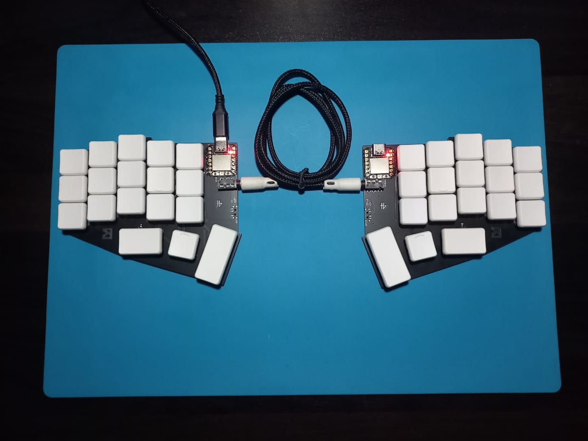

# The SHO (ষ)

The ষ (SHO) is a 36 key choc spaced split keyboard based on the Seeduino XIAO controller. For the design, I took huge inspiration from the gergoplex which I love the look of. This keyboard uses the Seeduino Seed RP2040 as the MCU, which is really great for the price and the small size. Just love how compact it turned out coming from MX boards.

## Features:

1. XIAO RP 2040 / BLE controller for wired/wireless versions
2. Reversible PCBs
3. Soldered on Kailh Choc V1 switches (Choc whites in my build)
4. TRS/TRRS connection between both halves
